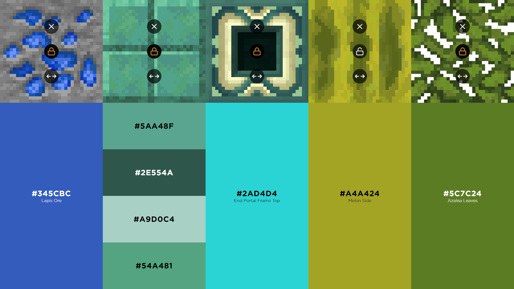

# MinecraftCoolors

## Showcase


## Installation & Run

```
git clone git@github.com:PeacefulOtter/MinecraftCoolors.git
```

```
cd app
npm install
npm start
```

```
cd server
npm install
npm start
```
